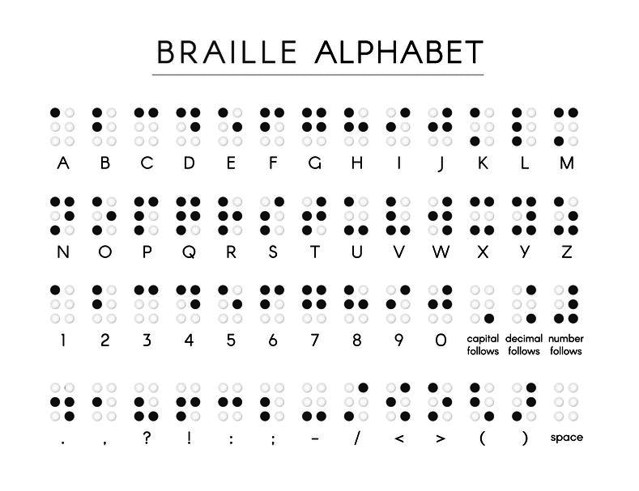

# BrailleCLITranslator
Originally a coding challenge for Shopify's Fall - Winter 2025 Engineering internship program. Original challenge requirements and image reference at the bottom.

## How To Use
In the terminal, 'CD' into the project directory and input 'node translate.js' before the text you wish to translate.

Input: <code>node translate.js Hello</code> 
Output: <code>.....OO.OO..O..O..O.O.O.O.O.O.O..OO.</code>

You can translate in the opposite direction as well!

Input: <code>node translate.js .....OO.OO..O..O..O.O.O.O.O.O.O..OO.</code> 
Output: <code>Hello</code>

## Technical Requirements
- Translator
  - Given arguments passed into the program at runtime, determine if the given string should be translated to English or Braille.
  - For Braille, each character is stored as a series of `O` (the letter O) or `.` (a period).
  - Store Braille symbols as a 6 character string reading left to right, line by line, starting at the top left. See examples below.
  - When a Braille `capital follows` symbol is read, assume only the next symbol should be capitalized. 
  - When a Braille `number follows` symbol is read, assume all following symbols are numbers until the next `space` symbol.
- Braille Alphabet
  - Letters `a` through `z`
    - The ability to capitalize letters
  - Numbers `0` through `9`
  - The ability to include `spaces` ie: multiple words

## Braille Reference

    

    <em style='font-size:xx-small;'>Black dots represent raised areas</em>

